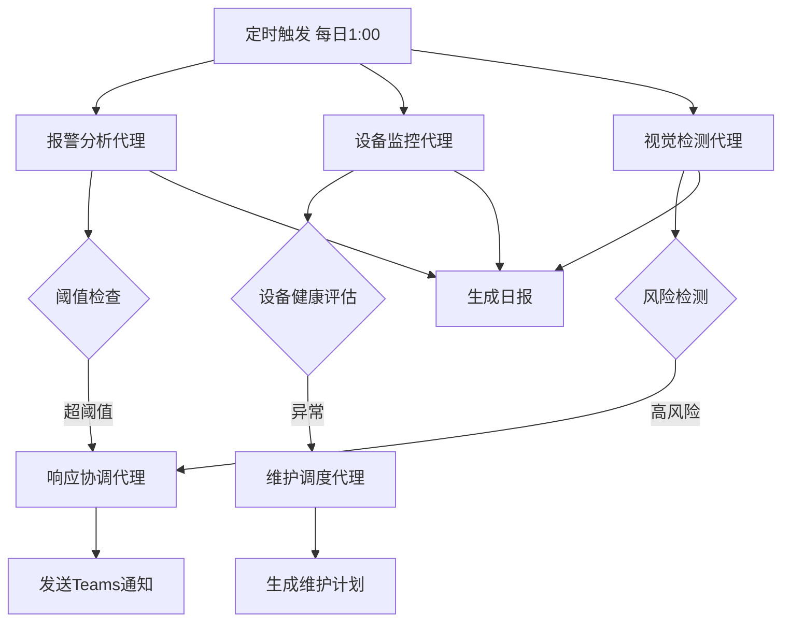
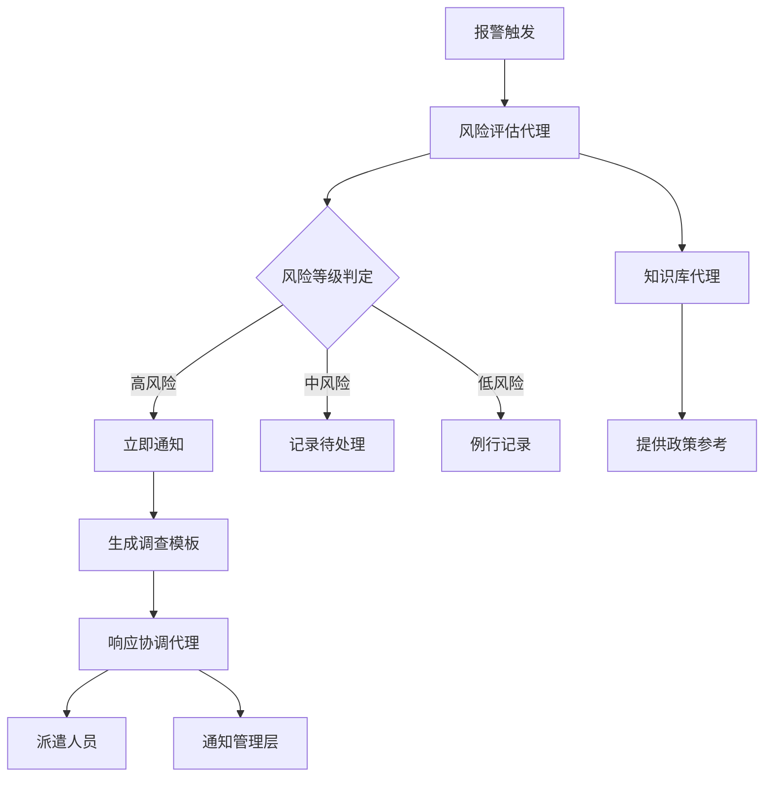

# 智能安防运营面板 - 系统架构文档

## 1. 系统概述

本系统是一个基于CrewAI多代理框架和Cherry Studio + MCP协议的智能安防运营中心数字化转型解决方案，整合门禁报警、CCTV监控、权限管理、巡检任务和设备管理于单一响应式面板。

### 1.1 核心技术栈

| 层级 | 技术 | 用途 |
|------|------|------|
| AI框架 | CrewAI 0.28.0 | 多代理协作编排 |
| 前端协议 | MCP (Model Context Protocol) | Cherry Studio集成 |
| 后端框架 | FastAPI 0.109 | RESTful API服务 |
| 前端UI | Streamlit 1.30 / React | 交互式仪表板 |
| AI服务 | Azure AI (OpenAI, Vision, Language) | 高级智能分析 |
| 数据处理 | Pandas, NumPy | 批处理分析 |
| 可视化 | Matplotlib, Plotly, Seaborn | 图表生成 |
| 计算机视觉 | OpenCV 4.9 | 本地图像处理 |
| 数据库 | SQLite | 轻量级存储 |
| 通知 | Teams Webhook, SMTP | 实时通知 |

## 2. 架构设计

### 2.1 总体架构

```
┌─────────────────────────────────────────────────────────────┐
│                     用户界面层                                │
│  ┌──────────────┐  ┌──────────────┐  ┌──────────────┐      │
│  │ Cherry Studio│  │  Streamlit   │  │   Mobile     │      │
│  │    前端      │  │   Dashboard  │  │     App      │      │
│  └──────┬───────┘  └──────┬───────┘  └──────┬───────┘      │
│         │                 │                  │               │
│         └─────────────────┼──────────────────┘               │
│                           │                                  │
└───────────────────────────┼──────────────────────────────────┘
                            │
          ┌─────────────────┴─────────────────┐
          │        MCP协议 / REST API         │
          └─────────────────┬─────────────────┘
                            │
┌───────────────────────────┼──────────────────────────────────┐
│                    业务逻辑层                                 │
│  ┌─────────────────────────────────────────────────────┐    │
│  │           CrewAI 多代理协作引擎                      │    │
│  │  ┌──────┐ ┌──────┐ ┌──────┐ ┌──────┐ ┌──────┐      │    │
│  │  │报警  │ │视觉  │ │响应  │ │设备  │ │风险  │      │    │
│  │  │分析  │ │检测  │ │协调  │ │监控  │ │评估  │ ...  │    │
│  │  │Agent │ │Agent │ │Agent │ │Agent │ │Agent │      │    │
│  │  └──┬───┘ └──┬───┘ └──┬───┘ └──┬───┘ └──┬───┘      │    │
│  └─────┼────────┼────────┼────────┼────────┼───────────┘    │
│        │        │        │        │        │                │
│  ┌─────┴────────┴────────┴────────┴────────┴───────────┐    │
│  │              FastAPI 业务服务层                       │    │
│  │  - 报警分析API    - 风险评估API    - 设备管理API    │    │
│  │  - 视觉检测API    - 知识库API      - 巡检KPI API    │    │
│  └─────────────────────────────────────────────────────┘    │
└───────────────────────────┬──────────────────────────────────┘
                            │
┌───────────────────────────┼──────────────────────────────────┐
│                    核心模块层                                 │
│  ┌──────────────┐  ┌──────────────┐  ┌──────────────┐      │
│  │ 报警分析模块  │  │ 异常检测模块  │  │ 设备管理模块  │      │
│  │ AlarmAnalyzer│  │VisionDetector│  │DeviceMonitor │      │
│  └──────┬───────┘  └──────┬───────┘  └──────┬───────┘      │
│         │                 │                  │               │
│  ┌──────┴───────┐  ┌──────┴───────┐  ┌──────┴───────┐      │
│  │ 风险分析模块  │  │ 知识库模块    │  │ 通知模块      │      │
│  │ RiskAnalyzer │  │KnowledgeBase │  │Notification  │      │
│  └──────────────┘  └──────────────┘  └──────────────┘      │
└───────────────────────────┬──────────────────────────────────┘
                            │
┌───────────────────────────┼──────────────────────────────────┐
│                     数据层                                    │
│  ┌──────────────┐  ┌──────────────┐  ┌──────────────┐      │
│  │ CSV/Excel    │  │   SQLite     │  │  向量数据库   │      │
│  │ 批处理数据    │  │   应用DB     │  │  知识库索引   │      │
│  └──────────────┘  └──────────────┘  └──────────────┘      │
│                                                              │
│  ┌──────────────────────────────────────────────────────┐  │
│  │        外部服务集成                                    │  │
│  │  Azure OpenAI | Azure Vision | Azure Language        │  │
│  │  Teams Webhook | SMTP | ExacqVision                  │  │
│  └──────────────────────────────────────────────────────┘  │
└──────────────────────────────────────────────────────────────┘
```

### 2.2 CrewAI代理架构

#### 2.2.1 代理角色定义

| 代理名称 | 职责 | 工具 | 协作模式 |
|---------|------|------|---------|
| **报警分析代理** | 趋势分析、阈值预警、图表生成 | AlarmAnalysisTool, ThresholdAlertTool | 独立分析 |
| **视觉检测代理** | CCTV异常识别、运动检测 | AnomalyDetectionTool, VideoAnalysisTool | 独立分析 |
| **响应协调代理** | 通知发送、任务分配、时间跟踪 | TeamsNotificationTool, EmailNotificationTool | 接受委托 |
| **设备监控代理** | TMS设备健康追踪、故障预测 | DeviceMonitorTool, MaintenanceSchedulerTool | 委托维护代理 |
| **风险评估代理** | AI风险判定、调查模板生成 | RiskAssessmentTool, TemplateGeneratorTool | 独立评估 |
| **知识库代理** | 政策查询、文档检索 | PolicySearchTool, DocumentRetrieverTool | 知识支持 |
| **维护调度代理** | 预测性维护计划、资源优化 | MaintenanceSchedulerTool | 接受设备代理委托 |
| **巡检KPI代理** | 绩效分析、热力图生成 | 数据分析工具 | 独立分析 |
| **屏蔽申请代理** | 流程自动化、审核通知 | TeamsNotificationTool | 流程代理 |

#### 2.2.2 任务编排流程

**每日自动化工作流：**



**事件响应工作流：**



### 2.3 数据流设计

#### 2.3.1 离线批处理模式

由于低带宽限制，系统采用离线批处理：

1. **数据采集**：每日从报警系统和ExacqVision导出CSV/Excel
2. **数据预处理**：清洗、标准化、时间戳对齐
3. **批量分析**：CrewAI代理在非工作时间（凌晨1点）执行
4. **结果缓存**：分析结果和图表缓存30天
5. **增量更新**：仅处理新增数据

#### 2.3.2 数据模型

**报警数据模型 (alarms_YYYYMMDD.csv):**

```csv
timestamp,device_id,alarm_type,location,area,description,response_time,is_false_alarm
2025-10-28 08:15:30,DOOR_A01,unauthorized_access,机房A,critical,"未授权刷卡尝试",180,false
```

**设备日志模型 (device_logs_YYYYMM.csv):**

```csv
timestamp,device_id,status,event_type,response_time_ms,error_code
2025-10-28 08:00:00,CAM_B05,online,heartbeat,95,
2025-10-28 08:05:00,CAM_B05,error,connection_lost,0,ERR_TIMEOUT
```

**视频截图命名规范:**

```
camera_{camera_id}_{YYYYMMDD}_{HHMMSS}.jpg
例如: camera_CAM_B05_20251028_081530.jpg
```

### 2.4 MCP协议集成

Cherry Studio通过MCP协议与后端通信：

```json
{
  "protocol": "websocket",
  "endpoint": "ws://localhost:8765",
  "methods": [
    "alarm_query",
    "risk_assessment",
    "device_status",
    "knowledge_search",
    "submit_shielding_request"
  ]
}
```

**消息格式示例：**

```json
{
  "id": "req_12345",
  "method": "risk_assessment",
  "params": {
    "alarm_description": "门禁异常",
    "context": {
      "timestamp": "2025-10-28T08:15:30",
      "location": "机房A",
      "location_type": "critical"
    }
  }
}
```

## 3. 核心功能模块

### 3.1 报警趋势可视化

- **数据源**：CSV批处理导入
- **分析维度**：
  - 时间趋势（每日/每周/每月）
  - 类型分布（门禁/CCTV/传感器）
  - 区域热力图
  - 误报率统计
- **输出**：
  - Matplotlib PNG图表
  - JSON统计数据
  - 阈值警报

### 3.2 AI异常检测

- **输入**：ExacqVision导出的JPEG截图
- **处理流程**：
  1. OpenCV运动检测（帧差法）
  2. Azure Computer Vision对象识别
  3. 风险评分计算
  4. 高风险事件自动通知
- **输出**：
  - 标注图像（框出运动区域/人员）
  - 风险评估报告
  - 需人工复核列表

### 3.3 设备管理（TMS）

- **健康评分算法**：
  ```
  健康分 = 在线时间(35%) + 低错误率(25%) + 快速响应(20%) + 维护合规(20%)
  ```
- **异常模式识别**：
  - 频繁离线/在线切换
  - 错误率突增
  - 响应延迟恶化趋势
- **预测性维护**：
  - 基于历史故障模式
  - 优先级排序（健康评分<50优先）
  - 备件库存联动警报

### 3.4 AI风险判定

- **多维度评估**：
  1. 关键词分析（高风险词权重+4）
  2. Azure情感分析（负面情绪+3）
  3. 时间因素（夜间×1.5）
  4. 地点因素（关键区域×2.0）
  5. 历史因素（重复报警+2）
- **风险分级**：
  - 高风险（≥7分）：5分钟响应
  - 中风险（4-6分）：15分钟响应
  - 低风险（<4分）：60分钟响应

### 3.5 知识库机器人

- **数据源**：
  - 公司安防政策（PDF/DOCX）
  - 国家标准（GB50348等）
  - 操作SOP（Markdown）
  - 历史案例数据库
- **检索技术**：
  - 文本嵌入（Azure text-embedding-ada-002）
  - FAISS向量检索
  - 语义相似度排序
- **交互方式**：
  - Cherry Studio聊天界面
  - Streamlit聊天组件
  - API调用

## 4. 安全与性能

### 4.1 安全措施

- **身份认证**：JWT令牌，1小时过期
- **角色权限**：RBAC（管理员/操作员/查看者）
- **数据加密**：静态数据加密，HTTPS传输
- **审计日志**：所有操作记录时间戳和用户

### 4.2 性能优化

- **离线缓存**：30天数据本地缓存
- **增量处理**：仅分析新增数据
- **异步任务**：FastAPI BackgroundTasks
- **图表压缩**：PNG压缩，DPI=150
- **批量API**：支持批量查询减少请求

### 4.3 可扩展性

- **水平扩展**：FastAPI多实例 + 负载均衡
- **存储扩展**：SQLite → PostgreSQL
- **代理扩展**：CrewAI动态添加新代理
- **模型切换**：支持Azure/OpenAI/本地LLM

## 5. 监控与维护

### 5.1 系统监控

- **健康检查**：`/api/v1/health` 端点
- **性能指标**：响应时间、吞吐量、错误率
- **日志管理**：Loguru结构化日志

### 5.2 故障恢复

- **数据备份**：每日自动备份到云存储
- **错误重试**：API调用3次重试机制
- **降级策略**：Azure不可用时使用本地规则

## 6. 部署架构

### 6.1 单机部署（推荐初期）

```
服务器配置：
- CPU: 4核
- 内存: 16GB
- 存储: 500GB SSD
- 操作系统: Ubuntu 22.04 / Windows Server 2022

服务组件：
- FastAPI (uvicorn) - 端口8000
- Streamlit Dashboard - 端口8501
- MCP WebSocket Server - 端口8765
```

### 6.2 容器化部署（可选）

```yaml
version: '3.8'
services:
  api:
    image: rmc-security-api:latest
    ports:
      - "8000:8000"
    volumes:
      - ./data:/app/data
  
  dashboard:
    image: rmc-security-dashboard:latest
    ports:
      - "8501:8501"
    depends_on:
      - api
```

## 7. 技术决策理由

| 决策 | 理由 |
|------|------|
| CrewAI | 多代理协作成熟，低代码快速开发 |
| FastAPI | 高性能异步框架，自动API文档 |
| Streamlit | 快速原型开发，数据科学友好 |
| SQLite | 轻量级，无需额外服务，适合中小规模 |
| 离线批处理 | 适应低带宽环境，降低实时性要求 |
| Azure AI | 企业级可靠性，多服务集成 |
| Matplotlib | 成熟稳定，图表质量高 |
| OpenCV | 开源免费，视觉处理强大 |

## 8. 未来演进路线

### 8.1 短期优化（1-3个月）

- [ ] 添加用户反馈循环，优化AI判定准确率
- [ ] 实现移动端APP（React Native）
- [ ] 集成更多设备管理系统API

### 8.2 中期增强（3-6个月）

- [ ] 升级到实时数据流（Kafka/RabbitMQ）
- [ ] 引入图神经网络进行设备故障关联分析
- [ ] 多站点部署和数据聚合

### 8.3 长期愿景（6-12个月）

- [ ] 自主学习代理（强化学习优化响应策略）
- [ ] AR巡检辅助（HoloLens集成）
- [ ] 全面数字孪生模拟

---

**文档版本**: 1.0  
**最后更新**: 2025-10-28  
**维护者**: 安防运营团队

